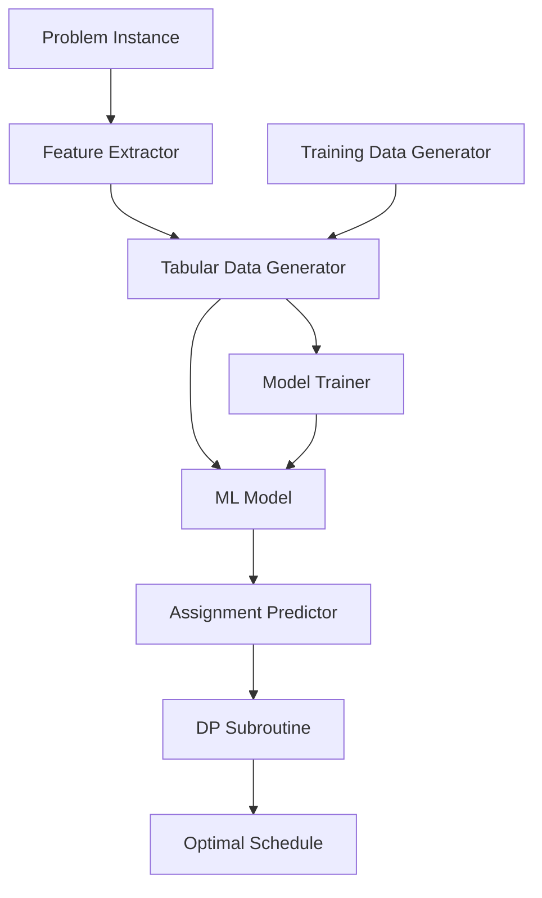

# Design Document: Structured ML Scheduling

## Overview

This design specifies a structured machine learning approach to parallel machine scheduling with energy-aware cost optimization. The system transitions from deep learning to traditional ML models (XGBoost, Gradient Boosting Regressor) that operate on manually engineered features extracted from tabular data.

The core insight is to leverage the structured nature of the problem: fixed horizon, known processing times, repeating price patterns, and discrete machine characteristics. Rather than learning representations, we manually engineer meaningful features and use ML models that excel at structured data to guide job-to-machine assignments. A dynamic programming subroutine handles optimal sequencing given assignments.

### Key Design Decisions

1. **Feature Engineering Over Representation Learning**: Manually design features that capture problem structure rather than learning representations
2. **Traditional ML Models**: Use XGBoost/GBR which excel at tabular data and provide interpretability
3. **Hybrid Approach**: ML guides assignment decisions; DP subroutine handles sequencing optimally
4. **Tabular Data Format**: Represent all problem states and decisions in CSV-compatible format
5. **Supervised Learning**: Generate training data by evaluating candidate assignments with DP subroutine

## Architecture

The system consists of four main components:



### Component Responsibilities

1. **Feature Extractor**: Extracts structured features from problem instances (price profiles, machines, jobs, horizon)
2. **Tabular Data Generator**: Converts features and decisions into CSV-compatible tabular format
3. **ML Model**: XGBoost or GBR model trained on tabular data to predict assignment quality
4. **Assignment Predictor**: Uses ML model to guide job-to-machine assignments
5. **DP Subroutine**: Optimally sequences jobs on each machine given assignments
6. **Training Data Generator**: Creates labeled training data by evaluating candidate assignments
7. **Model Trainer**: Trains ML models on tabular training data

## Components and Interfaces

### 1. Feature Extractor

**Purpose**: Extract meaningful features from scheduling problem instances.

**Interface**:
```
extract_features(problem_instance) -> feature_dict
  Input: problem_instance containing machines, jobs, price_profile, horizon
  Output: dictionary of extracted features
```

**Feature Categories**:

**Price Profile Features**:
- `num_cycles`: Number of complete 20-hour cycles in horizon
- `price_level_1`, `price_level_2`, `price_level_3`: The 3 main price levels
- `price_mean`, `price_std`, `price_min`, `price_max`: Statistical features
- `duration_level_1`, `duration_level_2`, `duration_level_3`: Duration of each price level
- `cycle_position(t)`: Position within current cycle at time t

**Machine Features**:
- `num_machines`: Total number of machines
- `energy_rates`: Array of energy rates per machine
- `energy_mean`, `energy_std`, `energy_min`, `energy_max`: Statistical features
- `energy_efficiency_rank`: Relative ranking of each machine by energy efficiency

**Job Features**:
- `num_jobs`: Total number of jobs
- `unique_processing_times`: Set of distinct processing times
- `job_counts_by_time`: Count of jobs for each processing time
- `processing_time_mean`, `processing_time_std`, `processing_time_min`, `processing_time_max`: Statistical features
- `total_workload`: Sum of all processing times
- `workload_to_capacity_ratio`: Total workload / (num_machines * horizon)

**Horizon Features**:
- `horizon_length`: Total time available
- `horizon_to_cycle_ratio`: Horizon / cycle_length

### 2. Tabular Data Generator

**Purpose**: Convert features and assignment decisions into tabular format for ML models.

**Interface**:
```
generate_tabular_row(problem_features, assignment_context, label) -> row_dict
  Input: 
    - problem_features: Features from Feature Extractor
    - assignment_context: Current state (machine loads, remaining jobs)
    - label: Target value (cost, quality metric)
  Output: Dictionary representing one row of tabular data
```

**Row Schema**:
Each row represents one assignment decision with columns:
- Problem instance features (price, machine, job, horizon features)
- Decision context features (current machine loads, job being assigned)
- Target label (resulting cost after DP sequencing)

**Serialization**:
```
to_csv(rows, filepath)
  Input: List of row dictionaries, output filepath
  Output: CSV file written to disk
  
from_csv(filepath) -> rows
  Input: CSV filepath
  Output: List of row dictionaries
```

### 3. ML Model

**Purpose**: Predict assignment quality using traditional ML models trained on tabular data.

**Supported Models**:
- XGBoost Regressor
- Gradient Boosting Regressor (sklearn)

**Interface**:
```
train(X_train, y_train, model_type='xgboost', hyperparameters=None)
  Input: Training features, labels, model type, optional hyperparameters
  Output: Trained model
  
predict(X) -> predictions
  Input: Feature matrix
  Output: Predicted quality scores
  
save_model(filepath)
  Input: Filepath for model persistence
  Output: Model saved to disk
  
load_model(filepath) -> model
  Input: Filepath to saved model
  Output: Loaded model
```

**Hyperparameters** (XGBoost defaults):
- `n_estimators`: 100
- `max_depth`: 6
- `learning_rate`: 0.1
- `subsample`: 0.8

### 4. Assignment Predictor

**Purpose**: Use trained ML model to guide job-to-machine assignments.

**Interface**:
```
predict_assignment(job, machines, current_state, ml_model) -> machine_id
  Input: Job to assign, available machines, current scheduling state, trained ML model
  Output: Selected machine ID
```

**Algorithm**:
```
For each candidate machine:
  1. Extract assignment context features (machine load, job characteristics)
  2. Combine with problem instance features
  3. Use ML model to predict assignment quality
  4. Select machine with best predicted quality
```

**Assignment Context Features**:
- `machine_current_load`: Current total processing time on machine
- `machine_remaining_capacity`: Horizon - current_load
- `job_processing_time`: Processing time of job being assigned
- `machine_energy_rate`: Energy rate of candidate machine
- `load_balance_metric`: Std dev of loads across machines after assignment

### 5. DP Subroutine Integration

**Purpose**: Leverage existing DP algorithm for optimal sequencing given assignments.

**Interface**:
```
optimal_sequence(machine_jobs, machine_energy_rate, price_profile, horizon) -> (sequence, cost)
  Input: Jobs assigned to a machine, machine energy rate, price profile, horizon
  Output: Optimal sequence and resulting cost
```

**Integration**:
The DP subroutine is called after all jobs are assigned to machines. It determines the optimal order to execute jobs on each machine to minimize cost given the price profile.

### 6. Training Data Generator

**Purpose**: Generate labeled training data by evaluating candidate assignments.

**Interface**:
```
generate_training_data(problem_instances, num_candidates_per_instance) -> tabular_data
  Input: List of problem instances, number of candidate assignments to generate per instance
  Output: Tabular data with features and cost labels
```

**Algorithm**:
```
For each problem instance:
  1. Extract problem features
  2. Generate multiple candidate assignments (random, greedy variants, etc.)
  3. For each candidate:
     a. For each job assignment decision:
        - Extract assignment context features
        - Combine with problem features
        - Create row in tabular data
     b. Run DP subroutine to get optimal sequences and total cost
     c. Label all rows from this candidate with resulting cost
  4. Aggregate all rows into training dataset
```

**Candidate Generation Strategies**:
- Random assignment
- Greedy by energy efficiency
- Greedy by load balancing
- Greedy by price-aware timing
- Hybrid strategies

### 7. Model Trainer

**Purpose**: Train ML models on generated tabular data.

**Interface**:
```
train_model(training_data, validation_data, model_type, hyperparameters) -> trained_model
  Input: Training data, validation data, model type, hyperparameters
  Output: Trained ML model
```

**Training Process**:
1. Load tabular training data from CSV
2. Split features (X) and labels (y)
3. Normalize/scale features
4. Train model with specified hyperparameters
5. Evaluate on validation set
6. Return trained model

**Evaluation Metrics**:
- Mean Absolute Error (MAE)
- Root Mean Squared Error (RMSE)
- R² Score
- Cost improvement vs baseline heuristics

## Data Models

### Problem Instance

```python
class ProblemInstance:
    machines: List[Machine]
    jobs: List[Job]
    price_profile: PriceProfile
    horizon: int
```

### Machine

```python
class Machine:
    id: int
    energy_rate: float
```

### Job

```python
class Job:
    id: int
    processing_time: int
```

### PriceProfile

```python
class PriceProfile:
    cycle_length: int  # 20 hours
    price_levels: List[float]  # 3 main levels
    level_durations: List[int]  # Duration of each level
    
    def get_price(self, time: int) -> float:
        # Returns price at given time point
```

### FeatureVector

```python
class FeatureVector:
    # Price features
    num_cycles: int
    price_level_1: float
    price_level_2: float
    price_level_3: float
    price_mean: float
    price_std: float
    price_min: float
    price_max: float
    duration_level_1: int
    duration_level_2: int
    duration_level_3: int
    
    # Machine features
    num_machines: int
    energy_mean: float
    energy_std: float
    energy_min: float
    energy_max: float
    
    # Job features
    num_jobs: int
    processing_time_mean: float
    processing_time_std: float
    processing_time_min: int
    processing_time_max: int
    total_workload: int
    workload_to_capacity_ratio: float
    
    # Horizon features
    horizon_length: int
    horizon_to_cycle_ratio: float
```

### AssignmentContext

```python
class AssignmentContext:
    machine_id: int
    machine_current_load: int
    machine_remaining_capacity: int
    machine_energy_rate: float
    job_processing_time: int
    load_balance_metric: float
```

### TabularRow

```python
class TabularRow:
    # Combines FeatureVector and AssignmentContext
    # Plus target label
    features: Dict[str, float]
    label: float  # Cost or quality metric
    
    def to_dict(self) -> Dict[str, float]:
        # Flattens all features and label into single dictionary
```

### Schedule

```python
class Schedule:
    machine_assignments: Dict[int, List[Job]]  # machine_id -> list of jobs
    machine_sequences: Dict[int, List[Job]]  # machine_id -> ordered jobs
    total_cost: float
```


## Correctness Properties

A property is a characteristic or behavior that should hold true across all valid executions of a system—essentially, a formal statement about what the system should do. Properties serve as the bridge between human-readable specifications and machine-verifiable correctness guarantees.

### Property 1: Feature Extraction Completeness

*For any* valid problem instance (with machines, jobs, price profile, and horizon), extracting features should produce a complete feature vector containing all required price, machine, job, and horizon features with valid values.

**Validates: Requirements 1.1, 1.2, 1.3, 1.4**

### Property 2: CSV Serialization Round Trip

*For any* valid tabular data structure, serializing to CSV format then deserializing should produce equivalent data with all features and labels preserved.

**Validates: Requirements 1.5, 5.5**

### Property 3: Feature Scaling Bounds

*For any* feature vector, after normalization/scaling, all feature values should fall within the expected range (e.g., [0, 1] for min-max scaling, mean=0 and std=1 for standardization).

**Validates: Requirements 1.6**

### Property 4: Price Cycle Count Correctness

*For any* horizon length and 20-hour cycle length, the computed number of complete cycles should equal floor(horizon / 20).

**Validates: Requirements 2.1**

### Property 5: Price Level Extraction

*For any* valid price profile, extracting price levels should identify exactly 3 distinct price levels.

**Validates: Requirements 2.2**

### Property 6: Statistical Feature Accuracy

*For any* collection of numeric values (prices, energy rates, processing times), computed statistical features (mean, std, min, max) should match the true statistics of the input data within numerical precision.

**Validates: Requirements 2.3, 3.2, 4.3**

### Property 7: Price Level Duration Sum

*For any* valid price profile with 3 levels, the sum of durations for all price levels should equal the cycle length (20 hours).

**Validates: Requirements 2.4**

### Property 8: Cycle Position Bounds

*For any* time point t and 20-hour cycle length, the computed position within the current cycle should be in the range [0, 20) and should equal t mod 20.

**Validates: Requirements 2.5**

### Property 9: Energy Efficiency Ranking Validity

*For any* set of machines with energy rates, the computed efficiency rankings should form a valid permutation (1 to n) where machines with lower energy rates receive better (lower) rank numbers.

**Validates: Requirements 3.3**

### Property 10: Job Count Consistency

*For any* set of jobs grouped by processing time, the sum of counts across all unique processing times should equal the total number of jobs.

**Validates: Requirements 4.2**

### Property 11: Workload Calculation

*For any* set of jobs, the computed total workload should equal the sum of all job processing times.

**Validates: Requirements 4.4**

### Property 12: Workload Ratio Correctness

*For any* problem instance, the computed workload-to-capacity ratio should equal total_workload / (num_machines * horizon).

**Validates: Requirements 4.5**

### Property 13: Tabular Schema Completeness

*For any* tabular row generated from a scheduling decision, the row should contain all required columns: problem instance features, decision context features, and target label.

**Validates: Requirements 5.1, 5.2, 5.3, 5.4**

### Property 14: Model Persistence Round Trip

*For any* trained ML model, saving to disk then loading should produce a model that generates equivalent predictions on the same input data.

**Validates: Requirements 6.5**

### Property 15: Prediction Feature Completeness

*For any* assignment prediction, the feature vector passed to the ML model should include all relevant features: machine loads, job processing times, and price profile features.

**Validates: Requirements 7.2, 7.3, 7.4**

### Property 16: Best Assignment Selection

*For any* set of candidate machines for job assignment, the system should select the machine with the best (lowest cost) predicted quality score from the ML model.

**Validates: Requirements 7.5**

### Property 17: DP Subroutine Invocation

*For any* complete job assignment (all jobs assigned to machines), the DP subroutine should be invoked exactly once per machine to determine optimal sequencing.

**Validates: Requirements 8.1**

### Property 18: Training Data Labeling Consistency

*For any* candidate assignment in training data, the cost label should be derived from evaluating that assignment with the DP subroutine.

**Validates: Requirements 8.3, 9.3**

### Property 19: Training Data Generation Coverage

*For any* problem instance used for training data generation, multiple candidate assignments (at least the specified number) should be generated and evaluated.

**Validates: Requirements 9.1, 9.2**

### Property 20: Training Data Feature Extraction

*For any* candidate assignment in training data, features should be extracted for each assignment decision within that candidate.

**Validates: Requirements 9.4**

### Property 21: Training Data Aggregation

*For any* set of problem instances, the aggregated training data should contain rows from all instances.

**Validates: Requirements 9.5**

### Property 22: Evaluation Metrics Computation

*For any* model evaluation, all three accuracy metrics (MAE, RMSE, R²) should be computed and reported.

**Validates: Requirements 10.1**

### Property 23: Cost Improvement Reporting

*For any* comparison between ML-guided schedules and baseline heuristics, the cost improvement percentage should be computed and reported.

**Validates: Requirements 10.3**

### Property 24: Feature Importance Extraction and Ranking

*For any* trained tree-based model (XGBoost, GBR), feature importance scores should be extracted for all features and features should be ranked by their importance values in descending order.

**Validates: Requirements 11.1, 11.2, 11.3**

## Error Handling

### Invalid Input Handling

**Missing or Malformed Data**:
- If problem instance is missing required fields (machines, jobs, price_profile, horizon), raise `ValueError` with descriptive message
- If price profile does not have exactly 3 price levels, raise `ValueError`
- If machine energy rates contain negative values, raise `ValueError`
- If job processing times contain non-positive values, raise `ValueError`
- If horizon is non-positive, raise `ValueError`

**Feature Extraction Errors**:
- If feature extraction fails due to invalid data, raise `FeatureExtractionError` with details
- If statistical computation encounters empty data, return NaN or raise error based on configuration

**CSV Serialization Errors**:
- If CSV file cannot be written (permissions, disk space), raise `IOError`
- If CSV file cannot be read or is malformed, raise `CSVParseError`
- If deserialized data has missing columns, raise `SchemaValidationError`

### ML Model Errors

**Training Errors**:
- If training data is empty or has insufficient samples, raise `InsufficientDataError`
- If training data has mismatched feature/label dimensions, raise `DimensionMismatchError`
- If model training fails to converge, log warning and return best model found
- If hyperparameters are invalid, raise `InvalidHyperparameterError`

**Prediction Errors**:
- If prediction input has wrong number of features, raise `FeatureMismatchError`
- If prediction input contains NaN or infinite values, raise `InvalidInputError`
- If model is not trained before prediction, raise `ModelNotTrainedError`

**Model Persistence Errors**:
- If model file cannot be saved, raise `IOError`
- If model file cannot be loaded or is corrupted, raise `ModelLoadError`
- If loaded model version is incompatible, raise `VersionMismatchError`

### DP Subroutine Integration Errors

**Integration Errors**:
- If DP subroutine is not available or cannot be imported, raise `DPSubroutineNotFoundError`
- If DP subroutine returns invalid results (negative cost, invalid sequence), raise `DPResultValidationError`
- If DP subroutine times out, raise `TimeoutError` with partial results if available

### Assignment Errors

**Assignment Validation**:
- If attempting to assign job to non-existent machine, raise `InvalidMachineError`
- If assignment would exceed machine capacity (load > horizon), raise `CapacityExceededError`
- If all machines are at capacity, raise `NoAvailableMachineError`

## Testing Strategy

### Dual Testing Approach

The system requires both unit testing and property-based testing for comprehensive coverage:

**Unit Tests**: Verify specific examples, edge cases, and error conditions
- Test specific problem instances with known optimal solutions
- Test edge cases (empty job sets, single machine, single job)
- Test error handling (invalid inputs, missing data)
- Test integration points between components
- Test CSV serialization with specific data formats

**Property Tests**: Verify universal properties across all inputs
- Test feature extraction with randomly generated problem instances
- Test statistical computations with random data distributions
- Test round-trip properties (CSV serialization, model persistence)
- Test invariants (cycle position bounds, ranking validity)
- Test aggregation properties (workload sums, count consistency)

### Property-Based Testing Configuration

**Library Selection**:
- Python: Use `hypothesis` library for property-based testing
- Minimum 100 iterations per property test (due to randomization)

**Test Tagging**:
Each property test must reference its design document property using this format:
```python
# Feature: structured-ml-scheduling, Property 1: Feature Extraction Completeness
def test_feature_extraction_completeness(problem_instance):
    ...
```

**Generator Configuration**:
- Generate random problem instances with varying sizes (1-100 machines, 1-1000 jobs)
- Generate random price profiles with 3 levels and varying durations
- Generate random horizons (20-1000 hours)
- Generate random energy rates (0.1-10.0)
- Generate random processing times (1-100)
- Ensure generators cover edge cases (minimum values, maximum values, boundary conditions)

### Test Coverage Requirements

**Feature Extraction** (Properties 1-12):
- Unit tests: Test specific known problem instances
- Property tests: Test with randomly generated instances (100+ iterations)

**Tabular Data** (Property 13):
- Unit tests: Test specific row formats
- Property tests: Test schema completeness with random data

**CSV Serialization** (Property 2):
- Unit tests: Test specific CSV formats
- Property tests: Test round-trip with random tabular data

**ML Model Training** (Properties 14, 22):
- Unit tests: Test training with small synthetic datasets
- Property tests: Test model persistence round-trip

**Assignment Prediction** (Properties 15, 16):
- Unit tests: Test specific assignment scenarios
- Property tests: Test feature completeness and selection logic

**DP Integration** (Properties 17, 18):
- Unit tests: Test specific assignment-sequence pairs
- Property tests: Test invocation and labeling consistency

**Training Data Generation** (Properties 19-21):
- Unit tests: Test with small problem instances
- Property tests: Test coverage and aggregation

**Feature Importance** (Property 24):
- Unit tests: Test with trained models on synthetic data
- Property tests: Test extraction and ranking logic

### Integration Testing

**End-to-End Workflow**:
1. Generate problem instance
2. Extract features
3. Generate training data with multiple candidates
4. Train ML model
5. Use model to guide assignments
6. Run DP subroutine for sequencing
7. Evaluate final schedule cost
8. Verify cost is reasonable compared to baselines

**Baseline Comparisons**:
- Random assignment
- Greedy by energy efficiency
- Greedy by load balancing
- Round-robin assignment

**Success Criteria**:
- ML-guided approach should outperform random assignment by at least 10%
- ML-guided approach should be competitive with or better than greedy heuristics
- Statistical significance test (t-test) should show p-value < 0.05

### Performance Testing

**Scalability Tests**:
- Test with increasing problem sizes (10, 50, 100, 500, 1000 jobs)
- Measure feature extraction time
- Measure training time
- Measure prediction time
- Ensure linear or near-linear scaling

**Memory Tests**:
- Monitor memory usage during training data generation
- Monitor memory usage during model training
- Ensure memory usage is reasonable for target problem sizes

### Validation Testing

**Model Quality Validation**:
- Cross-validation (5-fold) on training data
- Holdout test set evaluation
- Learning curves to verify model is learning meaningful patterns
- Feature importance analysis to verify sensible features are important

**Learning Component Validation**:
- Verify ML model predictions correlate with actual costs (R² > 0.5)
- Verify ML-guided assignments outperform random baseline
- Verify feature importance scores are non-uniform (learning is meaningful)
